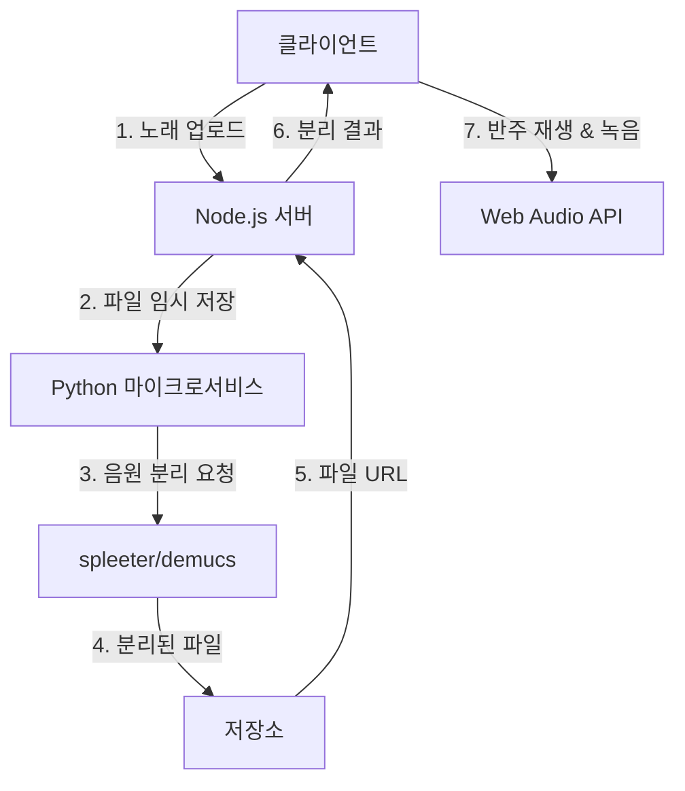

# 음원 분리 및 녹음 기능 구현 설계

## 1. 개요
업로드된 노래를 반주와 보컬 파트로 분리하고, 분리된 음원을 재생하며 반주에 맞춰 녹음할 수 있는 기능을 구현합니다.

## 2. 아키텍처 다이어그램

## 3. 서버 측 설계

### 3.1 음원 분리 프로세스
1. 클라이언트에서 mp3 파일 업로드 (multer 사용)
2. Node.js 서버가 파일 임시 저장
3. Python 마이크로서비스에 분리 요청 (HTTP/RPC)
4. spleeter/demucs로 보컬(vocal.mp3)과 반주(accompaniment.mp3) 분리
5. 분리된 파일 저장 (`server/separated_tracks/`)
6. 파일 URL 클라이언트에 반환

### 3.2 API 엔드포인트
- `POST /api/separate-audio`
  - Request: `{ "audioUrl": "업로드된 파일 URL" }`
  - Response: `{ "vocalUrl": "...", "accompanimentUrl": "..." }`

- `POST /api/upload-recording`
  - Request: `FormData` (녹음 파일)
  - Response: `{ "recordingUrl": "..." }`

### 3.3 파일 구조 추가
- `server/src/routes/separationRoute.ts`
- `server/src/services/audioSeparator.ts`
- `server/separated_tracks/` (디렉토리)

## 4. 클라이언트 측 설계

### 4.1 음원 재생 기능
- **기술**: howler.js
- **UI 컴포넌트**:
  - AudioPlayer (재사용 가능)
    - 재생/일시정지
    - 볼륨 조절
    - 진행률 표시
- **기능**:
  - 보컬/반주 트랙 개별 재생
  - 동시 재생 지원

### 4.2 녹음 기능
- **기술**: Web Audio API + MediaRecorder
- **워크플로우**:
  1. 반주 재생 시작
  2. MediaRecorder로 마이크 입력 캡처
  3. 녹음 데이터 실시간 버퍼링
  4. 반주와 녹음 동기화
  5. 녹음 완료 시 서버 업로드

### 4.3 파일 구조 추가
- `client/src/components/AudioPlayer.tsx`
- `client/src/components/Recorder.tsx`
- `client/src/utils/audioUtils.ts`

## 5. 기술 스택
- **분리 엔진**: Python (spleeter/demucs)
- **백엔드**: Node.js/Express
- **프론트엔드**: React + howler.js + Web Audio API

## 6. 구현 우선순위
1. 음원 분리 서비스 구축
2. 분리 API 엔드포인트 구현
3. 오디오 플레이어 컴포넌트 개발
4. 녹음 기능 통합
5. 동기화 메커니즘 구현